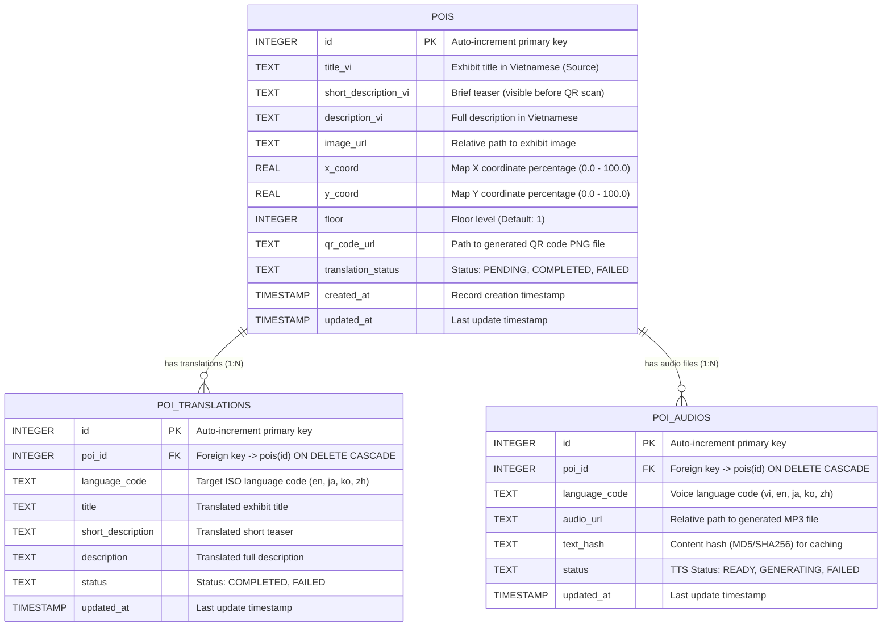
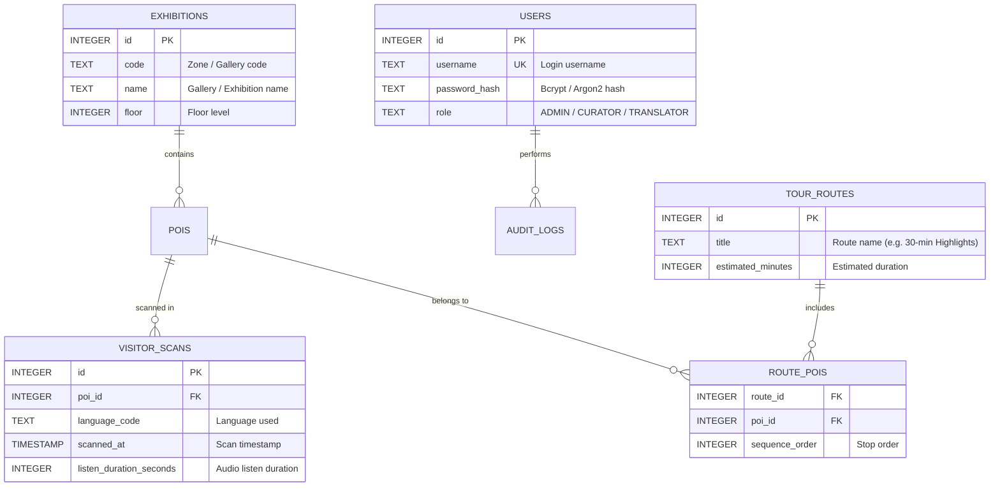

# Database Schema & ERD Design (Smart Museum POC)

> **Document:** Entity Relationship Diagram (ERD) and Database Specifications for the **Smart Museum — AI Audio Guide & Navigation (POC)** system.

---

## 1. Database Architecture Overview

During the Proof of Concept (POC) phase, the system leverages **SQLite** configured in **WAL (Write-Ahead Logging)** mode with `PRAGMA foreign_keys = ON;` to ensure:
- **High Performance & Non-blocking Concurrency:** Mobile visitor reads can occur simultaneously without being locked by backend write jobs (Google Translation & Edge-TTS synthesis background tasks).
- **Data Integrity:** Cascade deletion automatically cleans up related translations and audio records when a POI is deleted.

---

## 2. Entity Relationship Diagram (ERD)

---

## 3. Data Dictionary

### 3.1. `pois` Table (Points of Interest / Museum Exhibits)
Stores the primary exhibit information in the source language (Vietnamese), map coordinates, floor level, and associated QR code references.

| Field Name | Data Type | Constraints | Description |
|---|---|---|---|
| `id` | `INTEGER` | `PRIMARY KEY AUTOINCREMENT` | Unique identifier for the exhibit |
| `title_vi` | `TEXT` | `NOT NULL` | Exhibit title in Vietnamese |
| `short_description_vi` | `TEXT` | `NULL` | Brief preview description (shown before QR code scan) |
| `description_vi` | `TEXT` | `NOT NULL` | Full detailed description in Vietnamese |
| `image_url` | `TEXT` | `NULL` | Relative URL to exhibit cover photo |
| `x_coord` | `REAL` | `DEFAULT 0.0` | X-coordinate on floor plan (percentage / canvas unit) |
| `y_coord` | `REAL` | `DEFAULT 0.0` | Y-coordinate on floor plan (percentage / canvas unit) |
| `floor` | `INTEGER` | `DEFAULT 1` | Floor number where the exhibit is located |
| `qr_code_url` | `TEXT` | `NULL` | Relative URL to QR code image (`/static/qr/poi_{id}.png`) |
| `translation_status` | `TEXT` | `DEFAULT 'PENDING'` | Overall translation status (`PENDING`, `COMPLETED`, `FAILED`) |
| `created_at` | `TIMESTAMP` | `DEFAULT CURRENT_TIMESTAMP` | Timestamp of creation |
| `updated_at` | `TIMESTAMP` | `DEFAULT CURRENT_TIMESTAMP` | Timestamp of last modification |

---

### 3.2. `poi_translations` Table (Multilingual Translations — UC-08)
Stores translated titles and descriptions generated via Google Translate / Deep-Translator across supported languages (`en`, `ja`, `ko`, `zh`).

| Field Name | Data Type | Constraints | Description |
|---|---|---|---|
| `id` | `INTEGER` | `PRIMARY KEY AUTOINCREMENT` | Unique record ID |
| `poi_id` | `INTEGER` | `NOT NULL, FOREIGN KEY` | References `pois(id)` with `ON DELETE CASCADE` |
| `language_code` | `TEXT` | `NOT NULL` | Language code (`en`, `ja`, `ko`, `zh`) |
| `title` | `TEXT` | `NOT NULL` | Translated exhibit title |
| `short_description` | `TEXT` | `NULL` | Translated preview teaser |
| `description` | `TEXT` | `NOT NULL` | Translated full description |
| `status` | `TEXT` | `DEFAULT 'COMPLETED'` | Status (`COMPLETED`, `FAILED`) |
| `updated_at` | `TIMESTAMP` | `DEFAULT CURRENT_TIMESTAMP` | Timestamp of last modification |

* **Unique Constraint:** `UNIQUE (poi_id, language_code)` — Ensures each POI has only one translation entry per language.

---

### 3.3. `poi_audios` Table (TTS Audio Files & Caching — UC-09)
Tracks synthesized `.mp3` audio files generated by Microsoft Edge Neural TTS, utilizing content hashing to avoid redundant re-generation.

| Field Name | Data Type | Constraints | Description |
|---|---|---|---|
| `id` | `INTEGER` | `PRIMARY KEY AUTOINCREMENT` | Unique audio record ID |
| `poi_id` | `INTEGER` | `NOT NULL, FOREIGN KEY` | References `pois(id)` with `ON DELETE CASCADE` |
| `language_code` | `TEXT` | `NOT NULL` | Voice language code (`vi`, `en`, `ja`, `ko`, `zh`) |
| `audio_url` | `TEXT` | `NOT NULL` | Relative file path (`/static/audio/poi_{id}_{lang}.mp3`) |
| `text_hash` | `TEXT` | `NOT NULL` | Hash of synthesized text for intelligent cache validation |
| `status` | `TEXT` | `DEFAULT 'READY'` | TTS process status (`READY`, `GENERATING`, `FAILED`) |
| `updated_at` | `TIMESTAMP` | `DEFAULT CURRENT_TIMESTAMP` | Timestamp of last audio synthesis |

* **Unique Constraint:** `UNIQUE (poi_id, language_code)` — Ensures only one active audio file per POI per language.

---

## 4. Business Rules & Relationship Constraints

1. **1:N Cascade Deletion:**
   - Deleting a record in `pois` automatically cascades and deletes all associated records in `poi_translations` and `poi_audios`.
2. **Audio Caching Mechanism (Text Hashing):**
   - Before executing Microsoft Edge TTS synthesis, the backend computes the hash of the target text and compares it to `text_hash`. If unchanged, existing audio is reused to minimize synthesis latency and bandwidth.
3. **Locked vs. Unlocked Content Flow (UC-01 & UC-02):**
   - **Map/Overview Mode (Pre-scan):** Visitors only have access to `title` and `short_description`.
   - **Unlocked Mode (Post-scan):** After scanning the exhibit QR code, full `description` is unlocked and automated audio streaming is triggered.

---

## 5. Proposed Schema Evolution (MVP & Production Roadmap)

When moving beyond the POC to a full-scale deployment, the schema can be expanded as follows:

